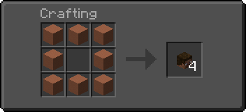
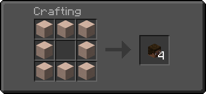
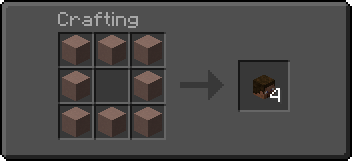
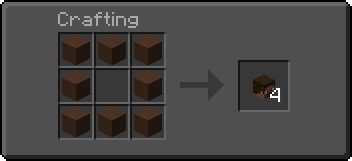

# 🤕 Кастомные головы

## Крафт голов

<figure><figcaption></figcaption></figure>

<figure><figcaption></figcaption></figure>

<figure><figcaption></figcaption></figure>

<figure><figcaption></figcaption></figure>

## Получение нужной головы

1. Перейдите на сайт [Minecraft Heads](https://minecraft-heads.com/) или [mcheads.ru](https://mcheads.ru/).&#x20;
2. Выберите голову и скопируйте её значение (значение можно найти почти в конце страницы выбранной головы).&#x20;

<figure><figcaption>
minecraft-heads.com
</figcaption></figure>

<figure><figcaption>
mcheads.ru
</figcaption></figure>

1. Вставьте скопированное значение в Книгу и Перо (Book & Quill).&#x20;
2. Положите нужное количество голов в вашу вторую руку (off-hand).&#x20;
3. Держите книгу со значением в основной руке (main-hand).&#x20;
4. Поменяйте руки местами, чтобы настроить голову (по умолчанию клавиша для смены рук — F).

## Получение головы по никнейму

1. Подпишите **Книгу и Перо** (_Book & Quill_) никнеймом игрока.
2. Положите нужное количество голов в вашу вторую руку (_off-hand_).
3. Держите подписанную книгу в основной руке (_main-hand_).
4. Поменяйте руки местами, чтобы настроить голову (по умолчанию клавиша для смены рук — **F**).

***


