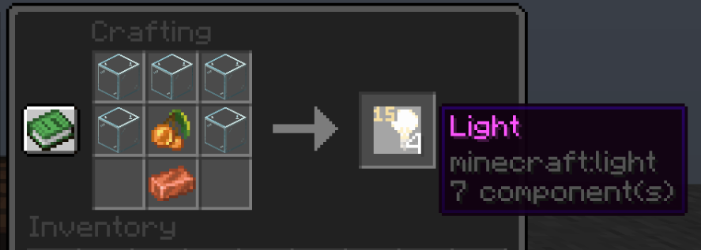
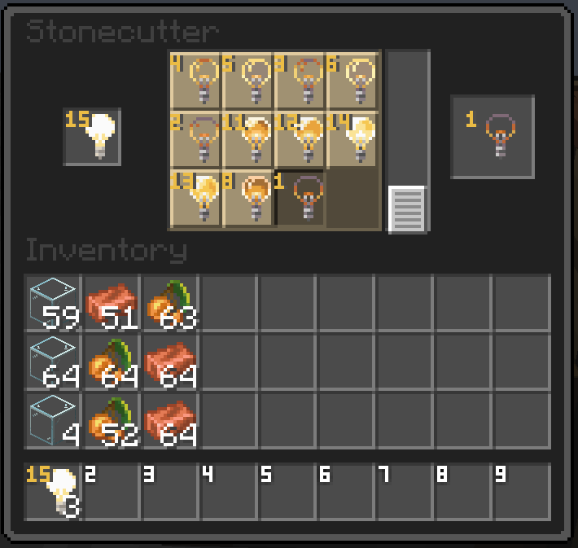

# 💡 Невидимый свет

### Крафт

<figure><figcaption></figcaption></figure>


### Изменение яркости блока:

<figure><figcaption></figcaption></figure>






```
Чтобы удалить световой блок, поместите его в левую руку, 
а затем посмотрите на выбранный световой блок: он должен 
загореться, а вокруг него должна загореться рамка. Подкрадитесь, 
и он упадет на пол, чтобы его можно было легко подобрать.
```


