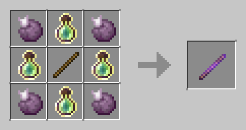

# 🪄 Палочка отладки


Для того что бы получить получить возможность пользоваться данным инструментом, вы должны получить соответствующий _<mark style="color:green;">PERMISSION</mark>_ от администрации&#x20;


<figure><figcaption>
Крафт "Debug Stick"
</figcaption></figure>

