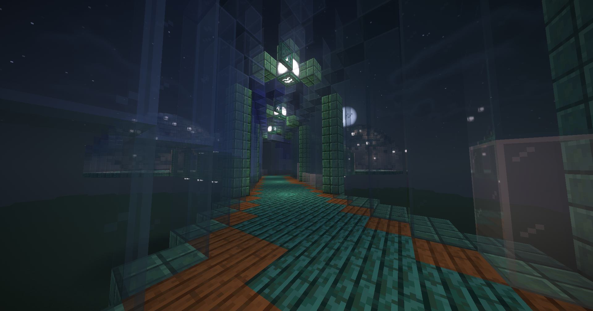

# Подводная база

<figure><figcaption></figcaption></figure>

| Материал                      | Всего |
| ----------------------------- | ----- |
| Бирюзовое стекло              | 1620  |
| Голубое стекло                | 1225  |
| Белое стекло                  | 1060  |
| Призмариновые кирпичи         | 790   |
| Окисленный резной медный блок | 579   |
| Синее стекло                  | 576   |
| Искажённые доски              | 546   |
| Гладкий кварц                 | 242   |
| Ступеньки из гладкого кварца  | 226   |
| Еловые доски                  | 178   |
| Искажённый люк                | 41    |
| Морской фонарь                | 38    |
| Свет                          | 24    |
| Кварцевая колонна             | 20    |
| Кварцевая плита               | 4     |
| Дубовые доски                 | 1     |
| Каменные кирпичи              | 1     |

## Скачать:




